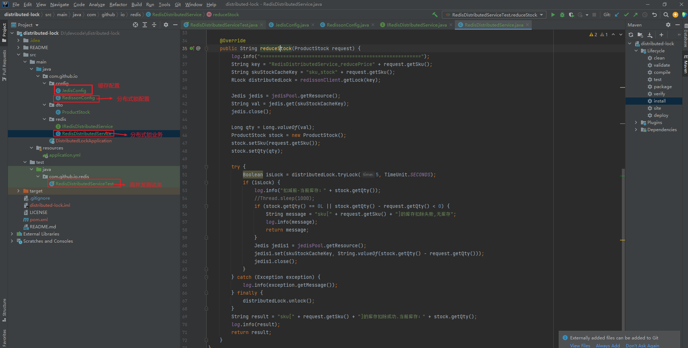
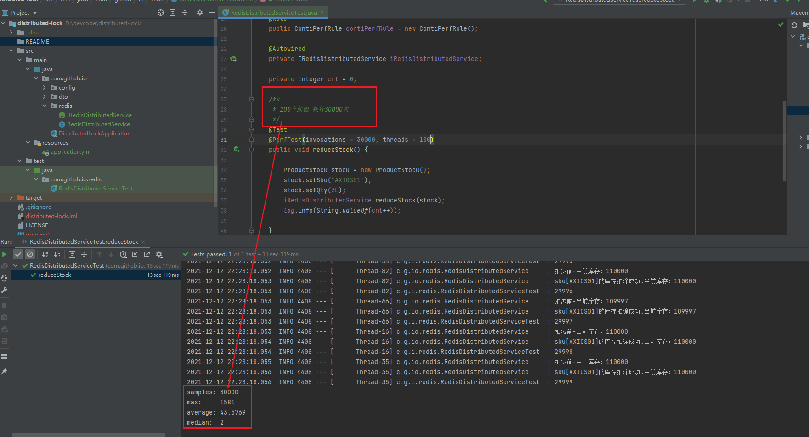
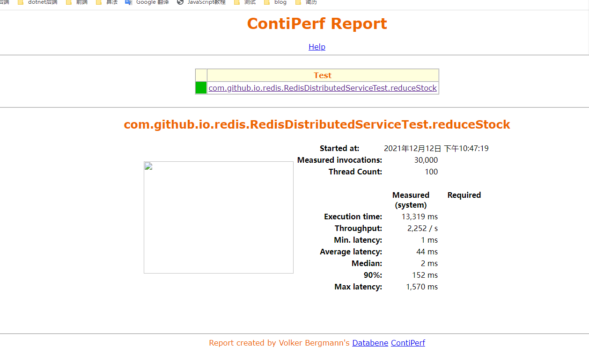

## distributed-lock
> redis分布式锁

[](https://travis-ci.org/spring/spring)

## 分布式锁实现的三种方式

基于数据库

基于redis

基于zookeeper

## 基于redis的分布式锁

##  使用示例
> 由于java项目一般使用spring boot,我们在maven项目中演示。
### 组件版本
|  组件   | 版本  |
|  ----  | ----  |
| spring boot | 2.3.2.RELEASE |
### 整体目录结构


###  性能压测


### 测试报告


###  代码地址
https://github.com/mqcode/distributed-lock.git
## 构建步骤
### 新建maven项目,引入以下依赖

```xml
  <dependencies>
    <dependency>
        <groupId>org.springframework.boot</groupId>
        <artifactId>spring-boot-starter-web</artifactId>
    </dependency>

    <dependency>
        <groupId>org.projectlombok</groupId>
        <artifactId>lombok</artifactId>
    </dependency>

    <!--jedis客户端 做缓存-->
    <dependency>
        <groupId>redis.clients</groupId>
        <artifactId>jedis</artifactId>
    </dependency>

    <!--redisson客户端 做分布式锁-->
    <dependency>
        <groupId>org.redisson</groupId>
        <artifactId>redisson-spring-boot-starter</artifactId>
        <version>3.16.4</version>
    </dependency>

    <!--测试相关依赖-->
    <dependency>
        <groupId>org.springframework.boot</groupId>
        <artifactId>spring-boot-starter-test</artifactId>
        <scope>test</scope>
    </dependency>

    <dependency>
        <groupId>org.databene</groupId>
        <artifactId>contiperf</artifactId>
        <version>2.3.4</version>
        <scope>test</scope>
    </dependency>

    <dependency>
        <groupId>org.junit.vintage</groupId>
        <artifactId>junit-vintage-engine</artifactId>
        <scope>test</scope>
    </dependency>
</dependencies>
```
### jedis配置 做缓存数据库
```java
@Slf4j
@Configuration
public class JedisConfig extends CachingConfigurerSupport {

    /**
     * SpringSession  需要注意的就是redis需要2.8以上版本，然后开启事件通知，在redis配置文件里面加上
     * notify-keyspace-events Ex
     * Keyspace notifications功能默认是关闭的（默认地，Keyspace 时间通知功能是禁用的，因为它或多或少会使用一些CPU的资源）。
     * 或是使用如下命令：
     * redis-cli config set notify-keyspace-events Egx
     * 如果你的Redis不是你自己维护的，比如你是使用阿里云的Redis数据库，你不能够更改它的配置，那么可以使用如下方法：在applicationContext.xml中配置
     * <util:constant static-field="org.springframework.session.data.redis.config.ConfigureRedisAction.NO_OP"/>
     * @return
     */

    @Value("${spring.redis.host}")
    private String host;

    @Value("${spring.redis.port}")
    private int port;

    @Value("${spring.redis.timeout}")
    private int timeout;

    @Value("${spring.redis.jedis.pool.max-active}")
    private int maxActive;

    @Value("${spring.redis.jedis.pool.max-idle}")
    private int maxIdle;

    @Value("${spring.redis.jedis.pool.min-idle}")
    private int minIdle;

    @Value("${spring.redis.jedis.pool.max-wait}")
    private long maxWaitMillis;


    @Bean
    public JedisPool redisPoolFactory(){
        JedisPoolConfig jedisPoolConfig = new JedisPoolConfig();
        jedisPoolConfig.setMaxIdle(maxIdle);
        jedisPoolConfig.setMaxWaitMillis(maxWaitMillis);
        jedisPoolConfig.setMaxTotal(maxActive);
        jedisPoolConfig.setMinIdle(minIdle);
        JedisPool jedisPool = new JedisPool(jedisPoolConfig,host,port,timeout,null);

        log.info("JedisPool注入成功！");
        log.info("redis地址：" + host + ":" + port);
        return  jedisPool;
    }

}
```

### redisson配置  做分布式锁
```java
@Configuration
public class RedissonConfig {
    private static final String SINGLE_REDIS_ADDRESS = "redis://127.0.0.1:6379";

    @Bean
    public RedissonClient redissonClient(){
        Config config = new Config();
        config.useSingleServer()
                .setAddress(SINGLE_REDIS_ADDRESS);

        RedissonClient redissonClient = Redisson.create(config);
        return redissonClient;

    }
}

```
### 库存实体
```java
/**
 * 商品库存表
 */
@Data
public class ProductStock {
    /**
     * 商品编码
     */
    private String sku;
    /**
     * 库存数量
     */
    private Long qty;
}
```
### 业务层
#### 接口
```java
public interface IRedisDistributedService {
    /**
     * 初始化库存
     *
     * @param request 请求
     */
    void initStock(ProductStock request);

    /**
     * 减库存
     *
     * @param request 请求
     */
    String reduceStock(ProductStock request);
}
```
#### 实现类
```java
@Slf4j
@Service
public class RedisDistributedService implements IRedisDistributedService {
    @Resource
    private RedissonClient redissonClient;

    @Autowired
    private JedisPool jedisPool;

    @Override
    public void initStock(ProductStock request) {
        String skuStockCacheKey = "sku_stock" + request.getSku();
        Jedis jedis = jedisPool.getResource();
        jedis.set(skuStockCacheKey, String.valueOf(request.getQty()));
        jedis.close();
        log.info("缓存设置成功,sku[{}]数量[{}]", request.getSku(), request.getQty());
    }

    @Override
    public String reduceStock(ProductStock request) {
        log.info("========================================================");
        String key = "RedisDistributedService_reducePrice" + request.getSku();
        String skuStockCacheKey = "sku_stock" + request.getSku();
        RLock distributedLock = redissonClient.getLock(key);

        Jedis jedis = jedisPool.getResource();
        String val = jedis.get(skuStockCacheKey);
        jedis.close();

        Long qty = Long.valueOf(val);
        ProductStock stock = new ProductStock();
        stock.setSku(request.getSku());
        stock.setQty(qty);

        try {
            Boolean isLock = distributedLock.tryLock(5, TimeUnit.SECONDS);
            if (isLock) {
                log.info("扣减前-当前库存：" + stock.getQty());
                //Thread.sleep(1000);
                if (stock.getQty() == 0L || stock.getQty() - request.getQty() < 0) {
                    String message = "sku[" + request.getSku() + "]的库存扣除失败,无库存";
                    log.info(message);
                    return message;
                }
                Jedis jedis1 = jedisPool.getResource();
                jedis1.set(skuStockCacheKey, String.valueOf(stock.getQty() - request.getQty()));
                jedis1.close();
            }
        } catch (Exception exception) {
            log.info(exception.getMessage());
        } finally {
            distributedLock.unlock();
        }
        String result = "sku[" + request.getSku() + "]的库存扣除成功.当前库存：" + stock.getQty();
        log.info(result);
        return result;
    }
}
```
### 压测
> 使用contiperf技术做压测  
> 注：@Test注解必须使用import org.junit.Test;下的,否则压测失效
```java
package com.github.io.redis;

import com.github.io.dto.ProductStock;
import lombok.extern.slf4j.Slf4j;
import org.databene.contiperf.PerfTest;
import org.databene.contiperf.junit.ContiPerfRule;
import org.junit.Before;
import org.junit.Rule;
import org.junit.Test;
import org.junit.runner.RunWith;
import org.springframework.beans.factory.annotation.Autowired;
import org.springframework.boot.test.context.SpringBootTest;
import org.springframework.test.context.junit4.SpringRunner;

@RunWith(SpringRunner.class)
@SpringBootTest
@Slf4j
public class RedisDistributedServiceTest {
    @Rule
    public ContiPerfRule contiPerfRule = new ContiPerfRule();

    @Autowired
    private IRedisDistributedService iRedisDistributedService;

    private Integer cnt = 0;

    /**
     * 100个线程 执行30000次
     */
    @Test
    @PerfTest(invocations = 30000, threads = 100)
    public void reduceStock() {

        ProductStock stock = new ProductStock();
        stock.setSku("AXIOS01");
        stock.setQty(3L);
        iRedisDistributedService.reduceStock(stock);
        log.info(String.valueOf(cnt++));

    }

    @Before
    public void initStock() {
        ProductStock stock = new ProductStock();
        stock.setSku("AXIOS01");
        stock.setQty(110000L);
        iRedisDistributedService.initStock(stock);
    }
}
```

## 关于作者
```
职业:软件工程师
微信:wlbinfo
开始制作时间:2021-12-12 23:00
```
